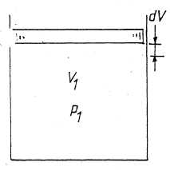
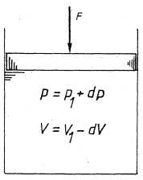
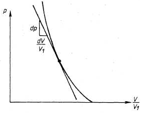
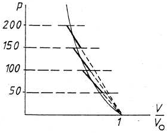

[E.1]

## _Reële vloeistoffen_ bezitten, volgende eigenschappen.

**Cohesie**: twee naast elkaar gelegen vloeistofmolekulen trekken elkaar aan. Deze aantrekkingskracht is vrij gering zodat de onderlinge plaats van de moleculen gemakkelijk kan gewijzigd, worden.

De aantrekkingskracht is echter groot genoeg om geen volumewijziging te bekomen m.a.w. 1 liter water blijft 1 liter water maar de vorm hangt af van de vorm van het reservoir waarin het water zich bevindt.

**Adhesie:** dit is de aantrekkingskracht tussen de vloeistof moleculen en de moleculen van de vaste wand.

**Samendrukbaarheid**: de samendrukbaarheid is zeer gering en treedt alleen op bij hoge drukken.

De samendrukbaarheid wordt behandeld in hoofdstuk 1.

We nemen als voorbeeld een buisje met een doorsnede van 1 cm²  gevuld met water tot op een hoogte van 100 cm en afgesloten door een zuiger (fig. 1). Plaatsen we op deze zuiger een gewicht van 2,07 kN dan daalt het niveau tot 99 cm. Het volume van het water vermindert dus met 1% wanneer er een druk heerst = 2,07 kN/cm² (207 bar).


## Vloeistoffen zijn volledig elastisch

Elastisch betekent dat het peil in vorig voorbeeld terug stijgt tot 100 cm als het gewicht terug wordt weggenomen. Volkomen elastisch, wil zeggen dat er nooit een residuële volumeverandering overblijft wat ook de druk is geweest; dit in tegenstelling met vaste lichamen Door deze elasticiteit worden stoten in een vloeistof met nagenoeg onverminderde sterkte doorgegeven.

_Inwendige wrijving_. Wanneer twee vloeistofdeeltjes over elkaar glijden met een verschillende snelheid ontstaat er een inwendige wrijving zoals die optreedt bij twee vaste lichamen die over elkaar glijden.

[E.2]

Bij iedere stroming ontstaat er een inwendige wrijving die afhankelijk is van de aard van de vloeistof (viscositeit). Over viscositeit wordt gesproken in hoofdstuk 2.

_Een ideale vloeistof_ heeft volgende kenmerken:

- _geen cohesie_: er is geen kracht nodig om twee vloeistofdeeltjes van elkaar te scheiden;
- _geen adhesie_: er is geen kracht nodig om een vloeistofdeeltje te scheiden van een vaste wand;
- ideale vloeistoffen zijn _niet samendrukbaar_;
- ideale vloeistoffen zijn _volkomen elastisch_;
- ideale vloeistoffen vertonen _geen inwendige wrijving_.

_Gevolgen_:

- de vloeistofdeeltjes kunnen over elkaar glijden zonder wrijving; dus kan de drukkracht die twee vloeistofdeeltjes op elkaar uitoefenen alleen loodrecht staan op het aanrakingsoppervlak (fig. 2).
- de vloeistofdeeltjes kunnen ook bewegen t.o.v. de vaste wand zonder wrijving; dus kan de drukkracht die een vloeistofdeeltje en een wand op elkaar uitoefenen alleen maar loodrecht staan op de wand (fig. 3).


[E.3]

# Soortelijke massa, soortelijk volume, relatieve dichtheid, soortelijk gewicht

## 1. DEFINITIES

### 1.1 Soortelijke massa of dichtheid

Engels: _density_

De soortelijke massa van een vloeistof is de massa per volume-eenheid.

$$ \rho = \frac{M}{V} $$

De soortelijke massa wordt uitgedrukt in kg/m³.

### 1.2 Soortelijk volume

_specific volume_

Het soortelijk volume van een vloeistof geeft aan welk volume door een eenheid van massa van een bepaalde vloeistof wordt ingenomen. Het soortelijk volume is bijgevolg de reciproke van de soortelijke massa.

$$ v = \frac{I}{\rho} = \frac{V}{m} $$

Het soortelijk volume wordt uitgedrukt in m³/kg.

### 1.3 Soortelijk gewicht

[_specific weight_](http://en.wikipedia.org/wiki/Specific_weight)

Vroeger (vóór 1 januari 1978) werd in de hydromechanica veel gebruik gemaakt van het begrip “soortelijk gewicht” (_γ_).

Het is het gewicht van de vloeistof per volume-eenheid.

$$ \gamma = \frac{G}{V} = \frac{Mg}{V} $$
​
$$ \gamma = \rho g $$


Eenheden: N/m³. In de uitdrukkingen waar vroeger _γ_ was aangegeven wordt nu _ρg_ geschreven.


[E.4]

### 1.4 Relatieve dichtheid

_relative density_, _specific gravity_

De relatieve dichtheid van een vloeistof wordt gedefinieerd als de verhouding van de massa of het gewicht van een bepaalde hoeveelheid vloeistof tot respectievelijk de massa of het gewicht van hetzelfde volume water bij 4°C. Het is dus een onbenoemd getal.

$$ \delta = \frac{G_{vl.}}{G_{w}} = \frac{M_{vl}}{M_{w}} = \frac{\rho_{vl}V}{\rho_{w}V} = \frac{\rho_{vl}}{\rho_{w}} $$

$$ \rho_{vl} = 1000 \delta_{vl} $$

Een vloeistof met een relatieve dichtheid _δ_ = 0,9 heeft dus een soortelijke massa _ρ_ = 900 kg/m³.

_Voordeel_ van relatieve dichtheid t.o.v. soortelijke massa. De relatieve dichtheid is een onbenoemd getal, dus onafhankelijk van een eenhedenstelsel. De vloeistof uit vorig voorbeeld heeft overal ter wereld een dichtheid van 0,9.

De getalwaarde van de soortelijke massa is wel afhankelijk van het gebruikte eenhedenstelsel.

$$ 900 \frac{kg}{m^3} = 7,5 \frac{lb}{gal} $$

_Nadeel_ van relatieve dichtheid t.o.v. de soortelijke massa. In formules werken we altijd met de soortelijke massa en nooit met de relatieve dichtheid omwille van de controle op de eenheden.

Nemen we als voorbeeld de eenvoudige formule:

$$ M = \rho V $$

$$ kg = \frac{kg}{m^3} m^3 $$

[E.5]

###### Opmerking

De soortelijke massa en alle andere afgeleide grootheden die hierboven gedefinieerd werden hangen af van het volume dat door de vloeistof ingenomen wordt in bepaalde omstandigheden.

Dit betekent dat het geen materiaalconstanten zijn, maar dat ze op zijn minst afhankelijk zijn van de toestandsgrootheden druk en temperatuur. De soortelijke massa hangt immers samen met de hoeveelheid moleculen die zich bevindt in een bepaald volume. Wordt de vloeistof samengedrukt, dan liggen de moleculen dichter bij elkaar en vergroot het aantal moleculen per volume-eenheid.

Stijgt de temperatuur dan wordt de activiteit van de moleculen heviger en vermindert de hoeveelheid per volume-eenheid. We gaan nu verder na in welke mate de soortelijke massa afhankelijk is van deze twee parameters en hoe deze afhankelijkheid in de praktijk kan weergegeven worden.

We merken hierbij op dat bij verandering van druk of temperatuur de massa van een bepaalde hoeveelheid vloeistof constant blijft maar dat wel het ingenomen volume wijzigt. We bekijken dan ook telkens eerst de verandering van het volume.

[E.6]

## 1.2. DRUKAFHANKELIJKHEID VAN DE SOORTELIJKE MASSA

**Compressibiliteit.** Bij grote drukstijgingen blijft de massa van de vloeistof konstant terwijl het volume vermindert. De soortelijke massa zal bijgevolg stijgen.

### 1.2.1. Verandering van het volume vloeistof in functie van de druk

#### a. Compressiemodulus

Wanneer men op een vloeistof een grote druk uitoefent vermindert het volume.

Bij vaste lichamen spreekt men van een elasticiteitsmodulus _E_ die een maat is voor de weerstand die het materiaal biedt tegen lengteverandering.

Bij vloeistoffen spreekt men van de **Compressiemodulus _E_**, eveneens uitgedrukt in N/m². Hoe groter _E_, hoe kleiner de volumeverandering.

We verbeelden ons nu een perfect stijve cilinder en zuiger. Wanneer op de zuiger geen kracht werkt is het volume vloeistof = _V₁_ (fig. 4). De  druk bedraagt _p₁_.





Wanneer nu een kracht _F_ op de zuiger wordt uitgeoefend dan verhoogt de druk op de vloeistof met _dp_ maar het volume neemt af met _dV_. Met een bepaalde druk _p_ correspondeert een overeenkomstig volume _V_  (fig. 5).

[E.7]

De volumeafname _dV_ is
- evenredig met de druk toename dp (hoe groter _dp_, hoe groter _dV_);
- evenredig met het oorspronkelijk volume _V_;
- afhankelijk van de aard van de vloeistof, wat kan uitgedrukt worden met behulp van de Compressiemodulus _E_.

Samengevat:

$$ dV = - \frac{V_1 dp}{E} of E = - \frac{dp}{dV/V_1}$$ (1.2)

Het minteken wijst erop dat we bij een druk toename een volumeafname krijgen.

Wanneer men de druk _p_ uitzet in functie van de volumeverhouding
$\frac{V}{V_1}$ (het volume bij de druk _p_ gedeeld door het oorspronkelijk volume) dan bekomt men een diagram zoals voorgesteld in figuur 6. De Compressiemodulus is dus niets anders dan de richting van de raaklijn getrokken in een bepaald punt van deze kurve (dus bij
een bepaalde druk _p_ en een bepaald volume _V_).

De compressiemodulus geeft dus, vertrekkend van een bepaalde druk _p_ en een bepaald volume _V_, de volumeverandering _dV_ bij een drukstijging _dp_.

We noteren bovendien dat de compressiemodulus afhankelijk is van de druk en het volume en stijgt naarmate de druk stijgt. Dit duidt erop dat een vloeistof minder gemakkelijk samengedrukt kan worden naarmate ze reeds meer samengedrukt is. Anders gezegd: de weerstand tegen samendrukking verhoogt, wat ook logisch is, vermits het steeds moeilijker wordt om de ruimte tussen de vloeistofmoleculen nog meer te verkleinen.

#### b. Compressiecoefficiënt

Naast de compressiemodulus _E_ wordt de compressiecoefficiënt gedefinieerd als:

$$\chi = \frac{1}{E}$$ (1.3)

$$\chi = \frac{\frac{dV}{V_1}}{dp_\chi}$$ (1.4)

Hoe kleiner _χ_, hoe kleiner de volumevermindering bij een drukstijging _dp_. Evenals _E_ is _χ_ dus ook geen constante, maar afhankelijk van de actuele waarden van druk en volume (zie fig. 6).

De eenheden van de Compressiecoefficiënt: _χ_ = m²/N.

[E.8]

#### c. Gemiddelde compressiecoëfficiënt $\chi_m$

Om de volledige compressibiliteit van een vloeistof te kennen zou men dus moeten beschikken over een experimenteel opgenomen curve zoals deze van figuur 6 waaruit dan de karakteristieke grootheden _E_ en _χ_ kunnen bepaald worden. In praktijk volstaat echter meestal een benaderde waarde voor deze grootheden.

Men neemt bijvoorbeeld als referentievolume het volume _V_ bij
atmosferische druk. Er wordt een gemiddelde waarde _χ_ opgegeven (experimenteel bepaald), die in het opgegeven drukinterval als een konstant gegeven mag beschouwd worden.

Tabel 1 geeft op die manier _χ_ voor een hydraulische olie voor verschillende drukintervallen.

druk (bar) | $\chi_m$ (m²/N)
---------: | --------------    0–50   | 800×10⁻¹²
    0–100  | 790·
    0–150  | 760·
    0–200  | 730·
    0–250  | 708·
    0–300  | 680·
    0–350  | 667·
    0–400  | 656·
    0–450  | 647·
    0–500  | 640·

Tabel 1

Men benadert op die manier de grafiek van figuur 6 met een bundel rechten waarvan de helling overeenkomt met de waarde $\chi_m$ (fig.7).



[E.9]

Uitdrukking 1.4 kan dan geschreven worden als

$$ dV = -\chi_m V_Odp $$

of

$$ dv = - \frac{I}{E_m}V_Odp $$

en vermits nu $\chi_m$ en $V_O$ als constanten te beschouwen zijn, geldt ook:

$$ \Delta V = - \chi_m V_O\Delta p$$

**Voorbeeld.** 500 liter (ℓ) van de hydraulische olie van tabel 1 wordt samengedrukt tot 200 bar. Wat wordt het volume bij 200 bar? Oplossing:

$$\begin{matrix}\chi_m = 730*10^{-12} \frac{m^2}{N}\\ \\\Delta V = \chi_mV_O\Delta p\\ \\\Delta V = 730*10^{-12} \frac{m^2}{N}*500ℓ*200*10^5\frac{N}{m^2} = 7,3 ℓ\end{matrix}$$

Het volume wordt dus: 500–7,3 = 492,7 liter. Het volume vermindert dus met ongeveer 1,5%. Vergelijk dit met een volumeafname van water bij 200 bar van ongeveer 1%. (p.E.1).

[E.10]

### 1.2.2. Verandering van de soortelijke massa in functie van de druk

Er geldt:

```
dV =- XVdp (1.4)
dV
V
■=- X dp Differentiatie  van M=pV
geeft:   0=pdV+Vdp _dp dV     _          dp V     -  "     p (1.5)
= Xdp
```

Maken we nu gebruik van de gemiddelde compressiecoëfficiënt die in het aangegeven interval als een constante mag beschouwd worden, dan geldt:

```
p                                D dp = X
S'
m p_
'p met -p =soortelijke massa bij atmosferische druk p a                                                                                                a
-p =soortelijke massa bij de druk p.
' p                                                J
- X = de gemiddelde compressiecoëfficiënt in het drukinterra
val (p-p )
a
In p -In p = X (p-p )
rp   ra   m ^ ra
= e VP-Pa}
of
X (p-p )
• m    a
p   =p   e *p *a
(1.6)
```

Voorbeeld.
Nemen we vorig voorbeeld dan kunnen we p. onmiddellijk uitrekenen. Stel p=900 kg/m .

```
a
ft__   73O.I0~I2.20O.I05 OT- -,C/1 .  , 3
p   =900 e                                         =913,2364 kg/m
```

[E.11]

**Opmerking.** Op pagina [E.5] is gezegd dat de massa onafhankelijk is van de druk. We maken even een kleine kontroleberekening op de resultaten van het voorbeeld uitgewerkt op pag. [E.9] en [E.10].

Bij atmosferische druk:

```
V=500 liter = 0,5 m3
3
p=900 kg/m
M=0,5.900=450 kg.
Bij_200_bar.
V   =49 2,7 liter = 0,49 27 m3
p200=913,2364 kg/m3
M=9I3,2364.0,4927
=449,95 kg.
```

Het verschil is te wijten aan afrondingen.

[E.12]

## 1.3 Temperatuurafhankelijkheid van de Soortelijke Massa

Wanneer we een vloeistof opwarmen behouden we dezelfde massa; het volume wordt echter groter zodat de soortelijke massa moet afnemen. Bij stijging van de temperatuur neemt de soortelijke massa af. Bij daling van de temperatuur neemt de soortelijke massa toe.

### 1.3.1 Verandering van het volume vloeistof in functie van de temperatuur
#### a. Kubieke uitzettingscoëfficiënt
Net zoals bij een vaste stof kan men de temperatuursafhankelijkheid van het volume van een vloeistof uitdrukken bij middel van de kubieke uitzettingscoëfficiënt. Proefondervindelijk kan men aantonen dat de volumetoename bij stijgende temperatuur - evenredig is met de temperatuursstijging;
- evenredig is met het oorspronkelijk volume;
- afhankelijk is van de aard van de vloeistof, wat kan aangeduid worden met behulp van de kubieke uitzettingscoëfficiënt _B_.

Er geldt dan volgend verband: $ dV = \beta VdT $ of

$$ \frac{dV}{V} = \beta dT $$ (1.7)

Eenheden van _β_: $ \frac{m^3}{m^3K} = \frac{I}{K} $

De kubieke uitzettingscoëfficiënt is, net als dat het geval was met de compressiecoëfficiënt, geen materiaalconstante, daar deze afhankelijk is van het actuele volume en de actuele temperatuur.

[E.13]

#### b. De gemiddelde kubieke uitzettingscoefficiënt
In praktijk volstaat het echter dikwijls om met een gemiddelde uitzettingscoëfficiënt $\beta_m$ te rekenen. Deze geldt dan in een bepaald (beperkt) temperatuursinterval en kan in dat interval als konstant aangezien worden. We schrijven dan:

$$ dV = \beta_mVdT $$

of $\Delta V = \beta_mV\Delta T$

In de laatste kolom van tabel 2 worden, voor water, de gemiddelde waarden van de kubieke uitzettingscoëfficiënt opgegeven waarmee mag gerekend worden in het interval [4, t].

temperatuur | soortelijke massa $\rho_t$ | $\beta_m$
   _°C_     |          _kg/m³_           |   _I/K_
----------: | -------------------------: | :--------
         0  |  999,8                     | −0,05·10⁻³
         4  | 1000                       |  0
        10  |  999,7                     |  0,05·
        20  |  998,2                     |  0,112·
        30  |  995,65                    |  0,167·
        40  |  992,2                     |  0,217·
        50  |  988,0                     |  0,262·
        60  |  983,2                     |  0,302·
        70  |  977,8                     |  0,340·
        80  |  971,8                     |  0,376·
        90  |  965,3                     |  0,410·
       100  |  958,4                     |  0,441·

Tabel 2.

[E.14]

### 1.3.2. Verandering van de soortelijke massa in functie van de temperatuur

Er geldt:

$$ \frac{dV}{V} = \beta \\ dT = -\frac{d\rho}{\rho} $$ (1.7) = (1.5)

of:

$$ -\frac{d\rho}{\rho} = \beta dT $$

Wanneer we gebruik maken van de gemiddelde uitzettingscoëfficiënt, die als een constante mag aangezien worden, dan kunnen we schrijven:

```
ƒ
P      m  j
dT ref
'ref
In p.-ln p  .=-£ (t-t  J
rt    rref  rm    ref
= e -P  (t-t  .)
rra    ref
ref
Pr P -j3 (t-t  -)
rm   ref
ref
(1.8)
```

Voor petroleumproducten is $t_{ref} = 20°C$.
Voor alcoholische producten is $t_{ref} = 15°C$.
Voor water is $\t_{ref} = 4°C$.

Figuur 8 schetst de verandering van ρ in functie van de temperatuur.


Voorbeeld:
In tabel 2 wordt ook de soortelijke massa van water bij verschillende temperaturen opgegeven.
We rekenen deze na bij 50°C.
Voor water wordt formule 1.8.
```
p50„c=1000 e-°>262-IO"3c50-4) =988 kg/m3
```

[E. 15]

Opmerkingen.

I. De temperatuurscoefficiënt.

Op figuur 8 zien we dat de verandering van p, in een klein temperatuursinterval, bijna lineair verloopt.
Bij kleine temperatuursvariaties die mogelijk zijn zonder drukverandering kan de verandering van de soortelijke massa dan ook 3
worden aangegeven door een temperatuurscoefficiënt bv.0,7 kg/m K De soortelijke massa wordt dan aangegeven door twee getallen.
Tabel 3 geeft de soortelijke massa van enkele vloeistoffen in functie van de temperatuur.

```
Produkt	P20qC kg/m	Temperatuurs-	Relatieve	Temperatuurscoëf		coef f iciënt	dichtheid	ficiënt van de 		(I0-40°C)		relatieve dicht		3 kg/m K		heid (I0-40°C)
Isobutanol	803	0,76	0,8030	0,00076
Isobutylacetaat	872,8	1,05	0,8728	0,00105
Isobutylacrylaat	890,6	1,01	0,8906	0,00101
Isobutylaldehide	790,5	1,1	0,7905	0,0011
Isopropanol	786,1	0,82	0,7861	0,0008 2
Isopropy1acetaat	873,7	1,15	0,8737	0,00115
Isopropylchloride	863,9	1,32	0,8639	0,00132
Tabel 3. Soortelijke massa in functie van de temperatuur.
```

Nemen we als voorbeeld isobutanol.
3
Het eerste getal (803 kg/m ) geeft de soortelijke massa bij 20°C.
3
Het tweede getal (0,76 kg/m K) geeft, in het temperatuursinterval
3
(I0-40cC)ïaan dat de soortelijke massa met 0,76 kg/m  vermindert (vermeerdert) telkens wanneer de temperatuur I°C  stijgt boven (daalt onder) de 20°C.
Van deze vloeistof is de soortelijke massa bij 35°C:
p  =803-15.0,76=791,6 kg/m3.

[E.16]

## 2. Temperatuursafhankelijkheid van de relatieve dichtheid

Evenals de soortelijke massa is de relatieve dichtheid afhankelijk van de temperatuur. Tabel 4 geeft de relatieve dichtheid in functie van de temperatuur voor butylmonoglycolether. We bemerken dat in het temperatuursinterval (-20°C, +39°C) de temperatuurscoëfficiënt nagenoeg constant is en ongeveer gelijk is aan Ov-0008.

temp. (°C)  | relatieve dichtheid
----------: | -------------------:
       −20  | 0,9357
       −19  |     49
       −18  |     40
       −17  |     32
       −16  |     24
       −15  |     16
       −14  |     07
       −13  | 0,9299
       −12  |     91
       −11  |     82
       −10  |     74
        −9  |     66
        −8  |     57
        −7  |     49
        −6  |     41
        −5  |     33
        −4  |     24
        −3  |     16
        −2  |     08
        −1  | 0,9199
         0  |     91
         1  |     83
         2  |     74
         3  |     66
         4  |     58
         5  |     50
         6  |     41
         7  |     33
         8  |     25
         9  |     16
        10  |     08
        11  |     00
        12  | 0,9091
        13  |     83
        14  |     75
        15  |     67
        16  |     58
        17  |     50
        18  |     42
        19  |     33
        20  |     25
        21  |     17
        22  |     08
        23  |     00
        24  | 0,8992
        25  |     84
        26  |     75
        27  |     67
        28  |     59
        29  |     50
        30  |     42
        31  |     34
        32  |     25
        33  |     17
        34  |     09
        35  |     01
        36  | 0,8892
        37  |     84
        38  |     76
        39  |     67

Tabel 4

[E.17]

**Voorbeelden.**

1. Een reservoir van 4m³ is bij 8°C boordevol vloeistof

p=I084 kg/m      + 0,8 kg/m K

Hoeveel liter zal er overlopen als de temperatuur stijgt tot 30°C?
Oplossing:
poe =1084+12.0,8=1093,6 kg/m
o C
Massa = 1093,6.4=4374,4 kg. .
Deze blijft ongewijzigd.
3
p,^or, = 1084-10.0,8=1076 kg/m
30°C
4374,4
V =
1076
:4,0654 m*
Er zal dus 65,4 liter vloeistof overlopen.
2. De perszijde van een centrifugaalpomp is, via een flexibel, verbonden met de leiding A B. (fig.9)
B
200m
A
Fig.9.'
Een vloeistof, met een s-m. =1050 kg/m  -0,8 kg/m K wordt naar het reservoir gepompt.
Om de vloeistof I°/0 in volume te doen verminderen is een druk nodig van 200 bar.
Bij het stilleggen van de pomp sluit de operator de afsluiter A en legt de pomp stil. Daarna begeeft hij- zich naar de tank en sluit afsluiter B.
De leiding tussen A en B zit dus vol met vloeistof.
Veronderstel dat, onder invloed van de zon, de temperatuur van de vloeistof stijgt van 20°C tot 22°C.
Welke drukstijging ontstaat er in de leiding?
Oplossing^
M=I050 >
E.18.
P22oC=I050-2.O,8=1048,4 kg/m'
V
22°C
1050 V
1048,4    -I.OOI526 V^
De procentuele stijging van het volume bedraagt:
1,001526-1 .ioo=0,1526V.
De drukstijging wordt dus:
200.0,1526=30,52 bar.
Tegen deze drukstijging zijn de leidingen en de afsluiters niet bestand. We kunnen deze drukstijging'-verhinderen door - ofwel: na het sluiten van B worden A en C geopend en een beetje vloeistof wordt afgelaten (Fig.IO)
- ofwel: na het sluiten van B wordt afsluiter D geopend zodat . de vloeistof kan uitzetten via het reservoir.
Fig.IO.
A
£>4

D 3. In een centrale verwarmingsinstallatie stijgt de temperatuur van het water bij het aanslaan van de ketel. Het water moet dus kunnen uitzetten om abnormale drukstijging te voorkomen. Hiervoor zorgt het expansievat.
4. We kunnen vorige toepassing veralgemenen. Overal waar een hoeveel'
heid vloeistof in een gesloten circuit zit moet een expansievat geplaatst worden. Er bevindt zich dus ook een expansievat op het ijswatercircuit van een luchtbehandelingsinstallatie.
5. In een tank wordt het peil gemeten. De stand bedraagt 7330 mm.
Twee dagen later is het peil 7318 mm zonder dat er vloeistof is bijgepompt of weggepompt.
Is er een lek? Niet zeker, want het kan het gevolg zijn van een temperatuursdaling.
Een kontrole is maar mogelijk indien men, naast het peil, ook de temperatuur kent.

[E.19]

1.4. DRUK-EN TEMPERATUURSAFHANKELIJKHEID VAN DE SOORTELIJKE MASSA

Hogere temperaturen van vloeistoffen zijn meestal maar mogelijk als gelijktijdig ook de druk wordt verhoogd.
Bij grote temperatuursveranderingen hebben we dan ook gewoonlijk drukveranderingen.
Tabel 5 geeft de verandering van de soortelijke massa van water in functie van temperatuur en druk.

```
Druk	0°C	50	100	150	2O0	250 -	300
bar 0	999,84	988,04
5	1000,1	988,2	958,6	916,9
10	1000,3	988,4	958,7	917,3
25	1001,1	989,1	959,5	918,0	865,4
50	1002,3	990,2	960,7	919,4	867,2	800,3
75	1003,5	991,3	961,8	9 20,7	869,0	803,1
100	1004,8	992,4	962,9	922,1	870,7	805 ,8	715,4
125	1006,0	993,3	964,1	923,4	872,4	808,5	720,6
150	1007,2	994,4	965,3	9 24,7	874,2	811	725,6
200	1009,6	996,5	967,4	927,3	877,6	816	734,6
250	1011,9	998,5	969,6	929,8	880,8	8 20,7	724,8
```

Tabel 5.

Voorbeeld.
Indien we de druk van water bij 0°C verhogen van I bar naar 200 bar dan neemt het volume af.
Wat wordt de volumeafname van 1000 kg water?
Bepaal X  in dit drukinterval.
m
Welke druk heeft men nodig om het volume met. I°/0 te doen verminderen.
Oplossing:
I. p =999,8 kg/m"
p200=1009,6 kg/m"
I0O0    3
1000 kg bij I bar hebben een volume =  .-q q,— m
IOOO     3
I00O kg bij 200 bar hebben een volume =       ■
1000       1000
m
1009,6
1000
AV = •
999,84
2. AV=-' X V^ Ap m O r ■-9,6687.10- -- X     999)84
X =4,83.10    m /N ^m  '
3. We stellen V=I00 en dus AV=I
1=4,83.IO"10.100 Ap *"7                 O
Ap = 2,07.IO+  N/m =207 bar.
=9,6687.IO"*3m3
200.10"
T.I.I.
Hoofdstuk I, Soortelijke massa- soortelijk volume- relatieve dichtheidsoortelijk gewicht.
M      3
Soortelijke^massa: p=     kg/m
I     V   3
Soortelijk volume: v= --- = ■■  m /kg
3
Soortelijk gewicht:r=pg  N/m
""""      "             Pvl
Relatieve dichtheid: 6= ---- onbenoemd pw
?vl= I00° 6vl
Drukafhankelijkheid   van  de   soorteli jke_massa._
1.  Verandering   van  het   volume in   functie  van  de  druk a7._-Ï-----     VA     -   -Xm  V0   Ap E              0
m
2. Verandering van de soortelijke massa in functie van de druk X (p-p)
m   *a
p =p  e rp ra
Temc-eratuurs af hankelijkheid  Xa£_Ëe  Ë22£--Iiiia„il!a£sa*
1.   Verandering  van  het  volume  in  functie  van  de  temperatuur AV=6 "VAT rm
2. Verandering van de soortelijke massa in functie van de temperatuur.
p =p  _ e rt  rref
Voor water -B  (t-t  J
rm    ref
Pt=P4e -6 (t-4)
m
Voor kleine temperatuurvariatie zonder drukvariatie Pt=p20°C -  temperatuurscoëfficiënt.At Soortelijke massa van kwik.

[T.I.2]

```
Temp.	Soort.	Temp.	Soort.
	massa		massa
°C	kg/m	°C.	kg/m
-10	13   619,8	20	13   545;8
-  9	617,3	21	543,4
-  8	614,8	22	540,9
-, 7	612,4	23	538,5
-  6	609,9	24	536,0
-   5	13   607,4	25	13   533,6
-   4	605,0	26	531,1
-   3	602,5	27	5 28,7
-   2	600,0	28	526,2
-  I	597,6	29	523,8
-  0	13   595,1	30	13   521,3
I	59 2,6	31	518,9
2	590,1	32	516,4
3	587,7	33	514,1
4	585,2	34	511,6
5	13   582,7	35	13   509,1
6A	580,3	36	506,6
7	577,8	37	504,2
8	575,4	38	501 ,8
9	5.72,9	39	499,4
10	13   570,4	40	13   496,9
II	568,0	50	472,5
12	565^5	60	448,2
13	563,0	70	424,0
14	560,6	80	399,8
15	13   558',I	90	13   372,3
16	555,7	100	351,5
17	553,2	110	3 27,9
18	550,7	120	304,0
19	548,3	130	280,1
```

[T.I.3]

**Soortelijke massa en $\beta_m$ voor water bij verschillende temperaturen**

```
Temperatuur °C.	Soort.Massa p, kg/m	^ I/K 0 4 10 20 30 40 50 60 70 80 90 100	999,8 1000 999,7 998,2 995,65 992,2 988,0 983,2 977,8 971,8 965,3 958,4	-0,05.IO~3 0 0,05.IO~3 0,II2.I0~" 0,I67.IO~"3 0,2I7.I0""3 0,262.I0~3 0,302.IO"3 0,340.IO~3 0,376.I0""3 0,4I0.I0""3 0,441.10
```

[T.I.4]

**Eigenschappen van water**

```
Temp.	Soort.	Soort.	Kompres.	Dyn.	Kinem.
	gewicht	massa	modulus	visc.	visc.
t	Y	P	E/105	T1.I03	v.io6
°C	3 kN/m	kg/m	k Pa	Pa s	m /s 0	9,805	999,8	1,98	1,781	1,785
5	9,807	1000,0	2,05	1,518	1,518
10	9,804	999,7	2,10	1,307	I ,306
15	9,798	999,1	2,15	1,139	1,139
20	9,789	998,2	2,17	1,002	I ,003
25	9,777	997,0	2,22	0,890	0,893
30	9,764	995,7	2,25	0,798	0,800
40	9,730	99 2,2	2,28	0,653	0,658
50	9,689	988,0	2,29	0,547	0,553
60	9,642	983,2	2,28	0,466	0,474
70	9,589	977,8	2,25	0,404	0,413
80	9,5 30	971,8	2,20	0,354	0,364
90	9,466	965,3	2,14	0,315	0,326
100	9,399	958,4	2,07	0,28 2	0,294
```

```
Indien E/I06=I,98 dan is E=I,98.10  k Pa
Indien T.10 =1,781 dan is TJ =1, 791.10   Pa s.
Indien V.io =1,785 dan is v=1,785.10   m /s.
```

[T.I.5]

**Kalibratietabel**

**Gemiddelde capaciteit**


[T.I.5 bis]

```
Capacitei t	Capaciteit		Capaciteit		Cap	aci teit 	°/0= kg	° / f   o	= kg	V	= kg	V	= kg
I	2112	26	7626	51	I3I4I	76	18655
2	2333	27	7847	52	I336I	77	18875
3	2553	28	8067	53	13582	78	19096
4	2774	29	8288	54	13802	79	I93I6
5	2994	30	8509	55	14023	80	19537
6	3215	31	8729	56	14243	81	19758
7	3435	32	8950	57	14464	82	19978
8	3656	33	9170	58	14684	83	20199
9	3877	34	9391	59	14905	84	20419
10	409 7	35	9611	60	I5I26	8 5	20640
II	4318	36	9832	61	15346	86	20860
12	4538	37	.10053	62	15567	87	21081
13	4759	38	1027 3	6 3	15787	88	21302
14	4979  -	39	10494	64	16008	89	21522
15	5 200	40	I07I4	65	16228	90	21743
16	5421	41	10935	66	16449	91	21963
■ 17	5641	42	III55	67	16670	92	22184
18	5862	43	II376	68	16890	93	22404
■19	608 2	44	II597	69	I7III	94	22625
20	6303	45	II8I7	70	I733I	95	22846
21	6523	46	12038	71	17552	96	23066
22	6744	47	12258	72	17772	97	23287
23	6965	48	12479	73	17993	98	^23507
24	7185	49	12699	74	I82I4	99	23728
25	7406	50	129 20	75	18434	100	23948
```

**Gemiddelde capaciteit**

```
0,1
0,2
0,3
0,4
0,5
0,6
0,7
0,8
0,9
/o  =
22,1 kilogram
/o =  44,1
=  66,2
=  88,2
= 110,3
= 132,3
= 154,4
= 176,5
= 198,5
```

Inhouden gelden voor een densiteit van 1,02 bij heersende temperatuur.

[E.20]

# HOOFDSTUK 2: Viscositeit

## 2.1. DEFINITIE

Wanneer  twee lagen van een reële vloeistof t.o.v. elkaar verschoven worden ontstaat er inwendige wrijving. De weerstand welke de twee over elkaar schuivende vloeistoflagen ondervinden is afhankelijk van de viscositeit van de vloeistof.
De viscositeit is dus een maat voor de weerstand tegen stroming
en hangt samen met de cohesiekrachten in de reële vloeistof en met de inwendige wrijving in de vloeistof.
D^!iX±2i:^5rlEe vl°eistoffen hebben grote cohesiekrachten, grote inwendige wrijving en hoge viscositeit.(bv. zware olie, teer).
Dunvloeibare_vloei stoffen hebben kleine cohesiekrachten, kleine inwendige wrijving en lage viscositeit (bv. water, benzine).

## 2.2 VISCOSITEITSWET VAN NEWTON

Om de viscositeit van een vloeistof te kwantificeren baseren we ons op het experiment van Newton.
We beschouwen een vloeistofreservoir met horizontale bodem waarin zich een vloeistof bevindt tot ap eea h-oogte h ne-bac* Cfig.II)

FIG.1l

snelheidsprofiel/in een Newfoniaanse vloeistof
Op deze vloeistof wordt een vlakke plaat gelegd met een oppervlakte 2
van Am. Om deze plaat een constante snelheid v te geven moet een kracht F uitgeoefend worden.
De kracht F is nodig om de weerstand tegen stromen van de vloeistof, de inwendige wrijving, te overwinnen.

[E.21]

Gaan we nu na welke stroming in de vloeistof door deze actie wordt teweeggebracht. Aan de bewegende plaat zal, omwille van de adhesiekrachten tussen de vloeistofmoleculen en de plaatmoleculen, een dun laagje vloeistof blijven kleven.
Dit laagje krijgt dus een snelheid v van de plaat. Aan de bodem
van het reservoir zal eveneens een dun laagje vloeistof kleven;
dit laagje heeft dus een snelheid nul.
Tussen het bovenste en het onderste laagje vloeistof bestaat dus een snelheidsverschil v. De vloeistoflagen daartussen gelegen worden in beweging gebracht door de inwendige wrijving. In fig.II.
werd het snelheidsverloop lineair verondersteld.
Volgens Newton is de kracht F, gelijk aan de totale inwendige wrijvingskracht, - onafhankelijk van de druk op de vloeistof
- recht evenredig met de~ oppervlakte A
- recht evenredig met het snelheidsverschil v tussen plaat en bodem
- omgekeerd evenredig met de hoogte h van de vloeis toflaag
- afhankelijk van de viscositeit van de vloeistof (de maat voor de weerstand tegen stroming)

Samengevat:

$$ F = \eta A \frac{v}{h} $$

Hierin is \$eta$ de dynamische viscositeitscoëfficiënt.

## 2.3.VERALGEMEENDE VISCOSITEITSWET

In het experiment van Newton werd het snelheidsverloop in de vertikale richting in de vloeistof lineair verondersteld. Zulke vloeistoffen worden Newtoniaans genoemd. De snelheid kan in een gelijkaardig experiment echter ook een verloop vertonen zoals bijvoorbeeld voorgesteld in figuur 12. We kunnen de viscositeitswet veralgemenen.


[E.22]

Hiertoe beschouwen we twee willekeurige, maar onderling rakende vloeistoflaagjes met een hoogteverschil dh.
Het onderste van deze twee laagjes heeft een snelheid v , het bovenste laagje een snelheid v +dv. In dit elementair dun gebied kan het snelheidsverloop lineair verondersteld worden. De wet van Newton wordt:
FI= T] A
dv
dh
F =de kracht nodig om het bovenste laagje t.o.v. het onderste te verschuiven.
Men kan ook schrijven:
F, = T|
dv
dh
of nog
x = de schuifspanning
Tj = de dynamische viscositei tscoëf f iciënt dv
dh
= de snelheidsgradiënt.
Deze betrekking kan voorgesteld worden in een (  x y
dv
dh
) diagram
en laat toe een onderscheid te maken tussen ideale, Newtoniaanse en niet-Newtoniaanse vloeistoffen. (fig.I3)
ideale vaste stof
Newtoniaans ideaal plastic
Newtoniaans F~
Newtoniaans Fig.I3
deal e vloeistof
Newtoniaanse vloeistoffen worden in zulk diagram door een rechte voorgesteld. De helling van deze rechte is een maat voor de dynamische viscositeitscoëfficiënt. In een Newtoniaanse vloeistof geldt ook een lineair snelheidsverloop (fig.II). De abscis van dit diagram
stelt de ideale vloeistof voor: geen cohesiekrachten, dus ook geen weerstand tegen stroming. De ordinaat stelt de ideale vaste stof voor E.23.
Vloeistoffen waarvoor het verband ( ~ , —tt—• ) niet lineair is dh
worden niet-Newtoniaans genoemd. Het snelheidsverloop is ook niet lineair. (fig.I2)
Opmerkingen:
1. In de uitdrukkung i = Tl —rr— komt de druk niet voor.
r       dh
Dat betekent dus dat zowel x als Tj onafhankelijk zijn van de druk.
Vermits de viscositeit een maat is voor de inwendige wrijving betekent dit dat bij vloeistoffen de inwendige wrijving niet verandert bij veranderlijke druk.
Enkel bij zeer hoge drukken stelt men een drukafhankelijkheid vast.
2. Elke. schuifspanning hoe gering ook, heeft een stroming tot gedv
volg omdat er, volgens de betrekking i = i\       ,   , een snelheidsgradiënt moet ontstaan, dus een snelheidsverschil tussen opeenvolgende vloeistoflaagjes.
3. Op een plaats waar      =0 is de schuifspanning x - 0 wat de grootte van de viscositeit ook moge zijn. In elk geval is de schuifspanning bij visceuze vloeistoffen die zich in rust bevinden steeds gelijk aan nul.
4. Het snelheidsprofiel in een vloeistof kan nooit rakend zijn aan een vaste wand. Dit zou immers betekenen dat de snelheidsgradiënt oneindig zou zijn. Ook de schuifspanning tussen de vloeistof en de vaste wand zou dan oneindig groot worden.
5. Tenslotte merken we nog op dat de snelheid aan de grens met de vaste wand altijd nul is. Er kleeft steeds een zeer dun laagje vloeistof aan de vaste wand. De vloeistof schuift dus niet over de vaste wand.
6. Het snelheidsprofiel kan niet loodrecht op de bewegende wand staan want dan is Ti    dv                       _                      ■
11 -ah-= L =0
waaruit  F  = x .A=0
Er zou dus geen kracht nodig zijn om de plaat te verschuiven.
E.24.
2.4. DYNAMISCHE VISCOSITEIT. EENHEDEN.
Nemen we terug de wet van Newton, geldig voor Newtoniaanse vloeistoffen.
F= 7] A
(
dv
dh
ï lineair snelheidsverloop)
11 =
Fh
Av
De dynamische viscositeitscoëfficiënt is in dit geval gelijk aan de kracht die per eenheid van oppervlakte (A=I) moet worden uitgeoefend om twee vloeistoflagen op een afstand gelijk aan de lengteeenheid van elkaar (h=I) t.o.v. elkaar te verplaatsen met de eenheid van snelheid (v=I)
Eenheden.
MKS stelsel
M =
Nm
Ns Technisch stelsel
c.g.s stelsel
2 .
m m/s kqf s m
dns = Pas m
= Poise (P)
cm
Opmerking:
De benaming dynamische viscositeit houdt verband met de eenheden waarin deze coëfficiënt wordt uitgedrukt nml. : N, s en m, de eenheden uit de dynamica.
Verband tussen de verschillende eenheden.
De wettelijke eenheid voor dynamische viscositeit is Pas.
Vooral in de Angelsaksische literatuur wordt de Poise zeer veel
gebruikt.
x -J£3|S_ . 9,81 -üf- = 9,81 Pas mm
I Pas = I
Ns m
I05.I
io4
dns -= 10 Poise = 10 P cm
I Pas = 10 P Verder I P = I0~  Pas -3
IcP = 10   Pas (IcP=I centiPoise)
IcP = ImPas (I milli Pascal seconde)

E.25.

2.5. KINEMATISCHE VISCOSITEIT. EENHEDEN.

De kinematische viscositeitscoëfficiënt (V ) is gedefinieerd als de verhouding van de dynamische viscositeitscoëfficiënt tot de soortelijke massa p.
Eenheden.
MKS stelsel
Ns MTechnisch stelsel
cgs stelsel
2 m
kg
2 m	3 m
s 2 cm
_  kqm s m
2  2
s  m  kg
m
= I St tStokes)
Opmerking
De benaming houdt ook hier verband met de eenheden gebruikt in de kinematica nml. meter  en seconde.
Verband tussen deze eenheden.
m
= 10
cm
= 10  St m
=10  c St I cSt = I
mm
=10
-6  m'
(centiStokes)
E.26.
216. VERBAND TUSSEN DE EENHEDEN VAN KINEMATISCHE EN DYNAMISCHE VISCOSITEIT.
In de uitdrukking
gebruiken we de volgende eenheden 2
V
m
T Pas p  : kg/m'
Ofwel.
v
Tl
P : cSt (IO°m /s)
_3
: c P=m Pas (10   Pas)
: kg/l (lO-3 kg/m3)
2.7. VOOR- EN NADEEL VAN DE KINEMATISCHE VISCOSITEIT T.O.V. DE DYNAMISCHE.
Bekijken we nog eens de dynamische viscositeitscoëfficient i Pas - i -V' .s-i    kTV   . i Jsa_ . -ai2                       2 2                     3     s m                       s m        m
In de dynamische viscositeitscoëfficient zit nog de soortelijke massa van de vloeistof.
Het voordeel van de kineraatische viscositeitscoëfficient is dat deze onafhankelijk is van de soortelijke massa van de vloeistof.
—6  2
Nemen we als voorbeeld een vloeistof waarvan V = 10*"  m /s.
3                                          6
Is p= 800 kg/m  dan is T = 800.10"  Pas 3                                           6
Is p=I000 kg/m  dan is f] =I000.I0"  Pas 3                                        —6
Is p=I200 kg/m  dan is tj =1200.io"  Pas Het nadeel van de kinematische viscositeit; volgens Newton is de dynamische viscositeit onafhankelijk van de druk op de vloeistof, De kinematische viscositeit is dus wel afhankelijk van de druk daar de soortelijke massa verandert met de druk.
E.27.
2.8.  PRAKTISCHE EENHEDEN VAN VISCOSITEIT.
Naast de hierboven vermelde eenheden bestaan er nog tal van andere eenheden voor viscositeit.
De drie hierna vermelde eenheden verwijzen naar de manier waarop de viscositeit wordt gemeten. Vermits de viscositeit in sterke mate afhangt van de temperatuur moet de viscositeit dus gemeten worden bij een welbepaalde temperatuur.
Het principe van al deze meters komt hierop neer dat een bepaalde hoeveelheid vloeistof bij een bepaalde temperatuur door een gekalibreerde opening moet stromen, waarbij de uitstroomtijd wordt gemeten .
I. Graden Engler_(°E2
Het aantal graden Engler is de verhouding tussen de tijd t 3
nodig voor het wegvloeien van' 200 cm  vloeistof bij een bepaalde temperatuur (t°C) en de tijd t  nodig voor het wegvloeien van dezelfde hoeveelheid gedistilleerd water van 20°C.
V
Het is de tijd nodig voor het wegvloeien van 60 cm  van de vloeistof bij een bepaalde temperatuur.
Voor een bepaalde vloeistof is de uitstroomtijd bij 60°F
(I5,S6°C) bv. gelijk aan•40 seconden. De viscositeit van deze vloeistof bij I5,56°C is dus 40 SSU.
3. 5edwood_N2__I__25^_.l2
"                                    3
De uitstroomtijd T van 50 cm  van de vloeistof bij t°C
vermenigvuldigd met de relatieve dichtheid bij t°C.
Re 1=100. ------------------------r-----------:---------------------Uitstroomtijd van 50 cm  van een speciale olie bij I5,56°C
vermenigvuldigd met de relatieve dichtheid bij I5,56°C.
^ T^  T      relatieve dichtheid van de vloeistof bij t°C
Re 1=100 53^-  ---------------  o,9I5------------------"J----2.9. VERBAND TUSSEN DE VERSCHILLENDE EENHEDEN VAN VISCOSITEIT.
Blz. E<*28 en E.29. geven een omrekeningstabel, (tabel 6)
Voorbeeld:
T] =200 cP    p = I kg/l     v =200 cSt=200.I0~ m /s=26 , 3°E=924 SSU
Tl= 90 cP    p=0,9kg/l    v =100 cSt = I00.I0~ m /s = !3 ,17° E=462 SSU
Tabel   6.
E.28, io"6v				Dynamische  viscositeit cP   =  mPas m   /s	°E	S.S.U.	Re  I
				p=0,9kg/l	p=Ikg/l	p=I,Ikg/l
I	I	—	—	0,9	I	1,1
1,2	1,027	—	—	1,08	1,2	1,32
1,4	1,052	—	—	1,26	1,4	1,54
1,6	1,075	—	—	1,44	1,6	1,76
1,8	1,098	—	—	1,62	1,8	1,98
2	1,119	32,6	30,2	1,8	2	2,2
3	1,217	36	32,7	2,7	3	3,3
4	1,307	39,1	35,3	3,6	4	4,4
5	1,393	42,3	37,9	4,5	5	5,5
6	1,479	45,5	40,5	5,4	6	6,6
7	1,564	48,7	43,2	6,3	7	7,7
8	1,651	52,0	46,0	7,2	8	8,8
9	1,740	55,4	48,9	8,1	9	q   q
10	1,831	58,8	51,7	9	10	II
12	2,02	65,9 ■v.	57,9	10,8	12	13,2
14	2,22	73,4	64,4	12,6	14	15,4
16	2,43	81,1	71,1	14,4	16	17,6
18	2,64	89,2	78,1	16,2	18	19,8
20	2,87	97,5	85,4	18	20	22
22	.3,10	106,0	92,9	19,8	22	24,2
24	3,34	114,6	100,4	21,6	24	26,4
26	3,58	123,3	108,1	23,4	26	28,6
28	3,82	132,1	115,8	25,2	28	30,8
30	4,07	140,9	123,7	27	30	33
Gebruik:   2,02oE£l2.I0~6m2/s==65 ,9   S.S.U
E.29.
-6 10  v				Dynamische viscositeit 2, m /s	°E	SSU	Re I	cP = mPas 				p=0,9kg/l	p=Ikg/l	p=I,I
35	4,7	163,2	143,3	31,5	35	38,5
40	5,33	185,7	163,2	36	40	44
45	5,98	208,4	183,2	40,5	45	49,5
50	6,62	231,4	203,3	45	50	55
56	7,41	259,0	227,4	50,4	56	61,6
60	7,93	277,4	243,5	54	60	66
. 70	9,23	323,4	283,9	63	70	77
80	10,54	369,6	322,9	72	80	88
90	11,86	415,8	364,4	81	90	99
100	13,17	462,0	404,9	90	100	110
120	15,8	554,4	485,9	108	120	132
140	18,43	646,8	566,9	126	140	154 '
160	21,06	739,2	647,9	144	160	176
180	23,69	831,6	728,9	162	180	198
200	26,3	924,0	809,8	180	200	220
220	28,9	1016	890,8	19.8	220	242
240	31,6	1109	971,8	216	240	264
260	34,2	1201	1053	234	260	286
280	36,8	1294	1134	252	280	308
300	39,4	1386	I-2I5	270	300	3 30
400	52,6	1848	16 20	360	400	440
500	65,8	2310	2024	450	500	550
600	78,9	2772	2429	540	600	660
700	92,1	3234	2834	630	700	770
800c	105,3	3696	3239	7 20	800	880
900	118,4	4158	3644	810	900	990
1000	131,6	46 20	4049	90Ó	1000	IIOO i..
E.30.
2.10.Toepassingen op de viscositeitswet.
I. De ruimte tussen twee grote platen op een afstand "van 30 mm van elkaar is gevuld met een Newtoniaanse vloeistof met een viscositeit 7] =0,9 Pas.
Welke kracht is er nodig om een dunne plaat met een oppervlakte 2
van 0,5 m  op 10 mm van de bovenrand te laten bewegen met een constante snelheid van 0,4 m/s. (fig.I4)
Oplossing;
F=F   +F
12
5
S es =     IJ A
h.
=0,9.0,5   (
= 27   N    .
T] A
0j4
0,01
_,*_ v= 0,4 m /s F
0±±_)
0,02
Fig.I4.
CS A = 0,5m2
'/////.
//////////
2.   Het  blok   van   figuur  15  glijdt  van   een  hellend   vlak   met  een constante   snelheid   v=0,25   m/s   op   een   oliefilm  met   een  dikte van  1,5  mm.   Het  blok  weegt  I30N   en  heeft  een  vierkantig  grondvlak   met  zijde  b=0,5   meter.
Bepaal   de  viscositeit  van   de  olie.
12
oliefilm
0=13 ON Oy=120N Fig.I5.                     Fig.16.
Oplossing.
Het  blok  glijdt  van  het  hellend  vlak   o.i.v.   de  komponente  van het  gewicht  in  de  richting  van  het  vlak.   (fig.16)
Vermits  de  snelheid  van  het  blok.konstant  is   geldt:
v
G   =    7) A -—
x                 h
_         5Q.I,5.I0""3          T   o   o
11 '     0,5.0,5.0,25   =   J'2   PaS 4.
E.32.
De ruimte tussen twee coaxiale cilinders wordt gevuld met glycerine (f.ig.18)
r =90 mm
u
1=0,6 m
ir. =8 5 mm
i
Om de binnenste/cilinder te doen draaien met een constante hoeksnelheid van I rad/s is een moment vereist van 0,7 Nm.
Bepaal: - de viscositeit van de glycerine - het vermogen dat in de vloeistof gedissipeerd wordt Fu
w
plaat F, w
dh
h
F
w
+v=konstanf
Fig.I8.                                                      Fig.I9.
Oplossing.^
In het experiment van Newton (pag.E.20) bewegen de opeenvolgende laagjes over elkaar met een verschillende snelheid. Er ontstaat dus wrijving tussen de over elkaar schuivende laagjes. Deze wrijvingskracht kan met behulp van de schuifspanning x uitgedrukt worden.
F = T A
w
Vermits In het experiment ook aangetoond wordt dat elk laagje met een constante snelheid beweegt moet voor elk vloeistoflaagje het krachtenevenwicht gerealiseerd zijn, zodat men kan stellen dat in elk vloeistofoppervlak, evenwijdig aan de vlakke plaat, eenzelfde kracht werkzaam is : F=F =T A.
W
Op een gelijkaardige wijze kan nu gesteld worden dat in elk cilindervormig oppervlak met straal r en met  schuifspanning t , hetzelfde moment werkzaam is.
M=0,7= T (2xcr.0,6)r E.33
Anderzijds geldt ook steeds: x =— T|
a   4.   dv      i         0,7
zodat   dr  =-----= - ------2----71      271.0,6 -q r ^      0,1857   dr of      dv= - ---L
dv
dr 71      r2
Integratie levert:
v                                          r U ^      0,1857 r  U   dr dv = - ---J------ /   --—
v.                            m    Jr.    2
i            'ir Met r. =0,085 m   v. =r. ü)=0 ,085 m/s i  '                        ii'
r =0,090 m   v =0
^085 =- °^Uq51      (- '   T 7]        0,090     0,085
T\ =1,43 Pas Vereenvoudigde berekening.
We veronderstellen de verandering van de snelheid lineair en we rekenen met de gemiddelde straal r =0,0875 m
3                                        m  7
M=F r =I A r mm
0,7= T (271.0,0875.0,6)0,0875
I = 24,25 Pa
dv
Met 1=7] ——
dr 24,25 = ,-^°85
0,005
7] = 1,426 Pas Het gedissipeerd vermogen P=MO)=0,7.I=0,7 W
E.34.
2.II-Verandering van de viscositeit in functie van de temperatuur.
Hoe groter de cohesiekrachten, hoe moeilijker de vloeistofdeeltjes ten opzichte van elkaar kunnen bewegen.
Bij stijgende temperatuur neemt de moleculaire beweging toe en deze beweging helpt mee om de krachten, die de beweging remmen, te overwinnen.
Bij stijgende temperatuur wordt een vloeistof dus meer vloeibaar en neemt de viscositeit af.
Er is geen algemene theorie die het verband geeft tussen de viscositeit van de verschillende vloeistoffen en de temperatuur.
Er werden veel methoden voorgesteld om deze temperatuurafhankelijkheid weer te geven. We bespreken in deze paragraaf enkele veel
gebruikte methoden, die ofwel in de praktijk algemeen aanvaard zijn ofwel in normen opgenomen werden.
a. In het "Handbook of Chemistry Physics" kan men, voor een ganse reeks vloeistoffen, de viscositeit ervan aflezen bij
verschillende temperaturen, bv.
Diphenyl                                                 Chloroform
70°C   1,49 CP                                      0°C    0,700 cP I00°C   0,97 CP                                  20°C    0,58 cP b.  Door een^gepaste schaalkeuze is men erin geslaagd de temperatuurafhankelijkheid van een ganse reeks vloeistoffen voor te stellen in één enkel diagram (fig.20)
Elke vloeistof kan in dat diagram voorgesteld worden door een punt in het x-y assenstelsel. De coördinaten x en y
worden afgelezen in bijhorende tabellen.
Hieronder geven we de x en y coördinaat voor de twee hogervermelde vloeistoffen. Deze waarden zijn ontleend aan het "Chemical Engineers Handbook".
Chloroform        14,4       10,2
Diphenyl                       12        18,3
Door een eenvoudige konstruktie kan hiermee, zoals voorgesteld in figuur 20, de viscositeit van bijvoorbeeld diphenyl bij
70°C en bij I00°C bepaald worden.
in Uj
U.
UU, Uj
-~j
5
Uj
U)
Uj
•U?
O.
o
OOQO Q P    O
S O
cm
''''■'' i I i   1—i.J-.i...l...r|,,.,|.A, , i ^ , ,  ,   hl f 1 | I | { (   LjrJ,..,i„,f [.,..!...,(, ii 11 , . .  i ItllM I I I 1  Ljm-L»J^m1..i.I...J..i . I ■ i i i f
OOOOOOOoo2°9 oooooooPoooo/oooooo  oooo  o  o  o  o   o   o   o  o
er- «o^voin-ir r~>o— o<r<Or-vom^rocM —/O o co r- u^/io ^hci-oO'«jr*u>   iam   ww    —           -^   cm
'  .» .1. >, I,  i,   L   <    i   / ,1 , 1 , t,  1,   \     I,    I    ,1    J   .1    ,|   ,  1 ,   I,   I,    1     1     J     .1    ,t   .  1  .   I
o   o o   o  o   o   o
O   o-   cG    r-    «X>    tn    ■<*/
cm
O
cm
T o
o
I
o
CM
I
3
I
•
O
•
en Pu
O
o
E. 36.
De^_viscosi tei tsindex. (V.I.)
Specifiek voor smeeroliën werd in 1929 het begrip viscositeitsindex ingevoerd. Men wenst immers dat smeeroliën hun smerende eigenschappen in een ruim temperatuursgebied behouden.
De smerende eigenschappen houden verband met de viscositeit van de olie.
Met behulp van de viscositeitsindex kan men zich een idee vormen over de kwaliteit van de olie in verband met de temperatuursgevoeligheid:
- een olie met een hoge V.I. is weinig temperatuursafhankelijk - een olie met een lage V.I. is sterk temperatuursgevoelig.
Om de viscositeitsindex te bepalen wordt de olie vergeleken met twee oliën  uit twee reeksen referentieoliën  die men in tabellen kan terugvinden.
De reeksen bestaan uit olieparen - die bij 210 F (=98,8°C) dezelfde viscositeit hebben - en bij 100 F (=37,8°C) een verschillende viscositeit.
De eerste referentiereeks bestaat uit oliësnwaarvan de viscositeit sterk gevoelig is aan de temperatuur.
De tweede referentiereeks bestaat uit oliën die nagenoeg niet teraperatuursafhankelijk zijn.
Men gaat dan als volgt te werk.
- men meet de viscositeit van de olie, waarvan men de V.I. wenst te bepalen, bij 210 F.
- men kiest uit twee tabellen de twee referentieoliën die bij
210 F dezelfde viscositeit hebben als de te meten olie - het verschil in viscositeit van de twee referentieoliën bij
100 F, dat eveneens in de tabellen kan afgelezen worden, geeft men de waarde 100
- men meet nu de viscositeit U van de te onderzoeken olie bij
100 F. .
E.37.
De viscositeitsindex wordt dan bepaald uit:
L-U
V.I. =  . ,, >. 100
Li—H
waarin:
U:de kinematische viscositeit van het te meten oliemonster bij
100 F.
L:de kinematische viscositeit van de standaardolie met V.I.=0, die bij 210 F dezelfde viscositeit bezit als het monster.
H:de kinematische viscositeit van de standaardolie met V.I.=100, die bij 210 F dezelfde viscositeit bezit als het monster.
Deze betrekking kan voorgesteld worden in figuur 21.
Viscositeit Fig.2I
210
F
Het kan ook voorkomen dat een olie zo gevoelig is dat de viscositeitsindex riegatief-wordt. Eveneens kan de-viscositeitsindex de IOO overschrijden. De moderne motoroliëh hebben allen een viscositeitsindex groter dan 100.
E.38.
d. In 1957 hebben Ubbelohde en Walther een nieuwe methode voorgesteld die aanvaard is zowel in de DIN normen (nr. 51563) als door de Amerikaanse ASTM (American Society of Testing Materials)
De methode is echter nog niet in de ISO normen opgenomen.
Volgens Ubbelohde en Walther kan de viscositeit van Newtoniaanse vloeistoffen in een ( W,log T) diagram voorgesteld worden door een rechte met richtingscoëfficiënt W -W„
m=
log T -log T_
c.   -                 1
waarin W= log [log( V+0,8)
2
V uitgedrukt is in mm /s (of cSt)
T uitgedrukt is in K Om de richtingscoëfficiënt m te vinden moet dus de viscositeit bij twee uiteenlopende temperaturen T  en T  gekend zijn of
opgemeten worden. Men eist hierbij ook dat deze temperaturen tenminste 50°C moeten verschillen.
Is m op deze wijze bepaald dan kan de viscositeit bij een willekeurige temperatuur berekend worden met behulp van de uitdrukking
W =m(log T -log T )+ W
x     3  m   3  x    m
met     W  =log   |log(   V   +0,8)]   bij   een   temperatuur  T X       ^                  X       ••                                                             X
W =log I log( V +0,8) ] bij een temperatuur T_ of T„.
m^L'mJ                                              I     2
E.39.
Voorbeeld.
2
Een minerale olie heeft bij 40°C een viscositeit van 103,4 mm /s o
(cSt) en bij I00°C een viscositeit van 8,45 mm /s (cSt).
Bepaal de viscositeit bij 80CC.
Oplossing:
I. We bepalen eerst de richtingscoëfficiënt m. Dit kan omdat de temperaturen 60°C (>50°C) verschillen.
T = 40°C=273+40=3I3 K T2=IOO°C = 273+IOO = 3 7 3..K V =103,4 mm /s 2
v~=8,45 mm /s W.
W.
=log [log ( V +0,8)] =log [log(103,4+0,8)] =0,30489
, = log [ log ( v2+0,8)j = = log [ log (8 ,45+0 ,8 ) ] =-0,01496
log T =log 313=2,49554
log T2=log 373=2,57171
m= wI-w2
log T2-log T 0,30489+ 0,01496
2,57171-2,49554
2. Viscositeit bij 80°C.
a. Uitgaande van T =T =313 K ml
V = V =103,4 mm /s ml
W =W =0,30489
ml'
W =m(log T -log T )+W
x       m   ^  x   m
= 4,199
W
80°C
=4,199 [log 3I3-log(273+80)] +0,30489=0,08555
W =log [log( V +o,8)l
O,08555=log [log( V +0,8)]
log( V +O,8)=I0°'08555=I,21777
I P T 7 7 7
V +0,8=10 '     =16,5094
x  7                               '
Vo0oc=I5,7094 mm /s of cSt b. Uitgaande van T =T =373 K m  2                   2
V = Vn=8,45 mm /s m   2
W =W =-0,01496
m  2
vinden we analoog:
v80OC=I5,709 mm2/s (cSt)
E. 40.
Opmerkingen.
De Amerikaanse ASTM normen werken met dezelfde formules maar rekenen met W=log [log( V +0,7 ) ]
Alleen bij zeer kleine viscositeiten wijken de resultaten af
van deze berekend volgens de DIN-normen.
Om het rekenwerk te ontwijken werden door Ubbelohde de berekeningsformules voorgesteld in een nomogram, (een grafiek)
waarmee de gezochte waardes via een grafische konstruktie kunnen bepaald worden.
Met de huidige rekenapparatuur levert het rekenwerk echter geen enkele moeilijkheid meer. De gebruikte formules kunnen eventueel
ook gemakkelijk geprogrammeerd worden.
De voorgestelde formules gelden, strikt genomen, alleen voor enkelvoudige vloeistoffen en niet voor mengsels.

